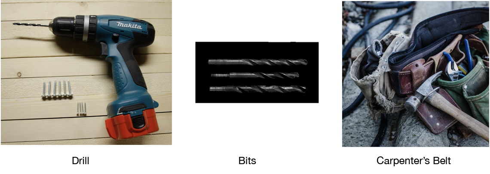
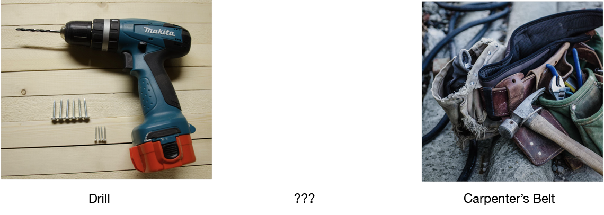
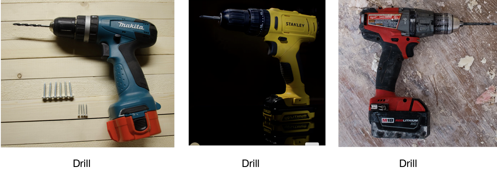

# Personalized and Shopping Cart Recommendations

To make recomemndations for

 - **users**
 - **items**
 - **sets of items**
 
The Universal Recommender can be built with one dataset and one Engine Instance, which manages one model. To add Complementary Items recommendations you'll need to  add an Engine Instance. But the two are very similar and have exactly the same input format and parameters. When you make an `itemSet` query to the "Complementary Items Engine Instance" it will return recommendations for:

 - **complementary items/shopping cart**

# Complementary Items

The Universal Recommender typically takes input that allows personalized recommendations to be made and also supports item-based and item-set based recs. These make sense because ALL indicators/events have a user-id that joins the data&mdash;all input has a user-id that is used to model the user's behavior. Item and item-set similarity is in terms of the user behavior

But what if you want to find missing items in a set? You have a shopping cart with a couple things in it and need to recommend the items that will be needed with the current cart contents. This is not a question of user preference so much as what things typically go together. In Machine Learning this is often called ***Complementary Item*** or ***Frequent Patterns*** since the items complement each other or are often seen as a set. Notice the spelling, which means; "the items enhance or emphasize the qualities of each other."

Let's look at a "Complete" group of items that complement each other:

## Complete Complementary Item Group 



Imagine that the data shows these are most commonly purchased together. Now take one away:

## Shopping Cart in Progress



If these were inside a user's shopping cart the question is "what is missing?" The best answer comes from Complementary Items analysis.

Fortunately the data for this is often easy to obtain if we have personalized recommendation data. All we need to do is identify the groups, which is often done with shopping-cart-ids. With group-ids like shopping-cart-ids the Universal Recommender can identify items that form groups and the items that are most likely missing from those groups.

**Personalized Data**: typical personalized recommendations can be derived from many things but have a primary "conversion" indicator like "buy". They are sent to the UR as:

```
{
   "event" : "buy",
   "entityType" : "user",
   "entityId" : "John Doe",
   "targetEntityType" : "item",
   "targetEntityId" : "Makita Electric Drill",
   "eventTime" : "2015-10-05T21:02:49.228Z"
}
```

Skip to the Similar Items section if this is your data.

**Complementary Items Data**: To get Complementary Items in results we first must have data that includes the group-id, IN PLACE OF the user-id. They are sent to the UR as:

```
{
   "event" : "buy",
   "entityType" : "user",
   "entityId" : "x-7eb98af2345",
   "targetEntityType" : "item",
   "targetEntityId" : "Makita Electric Drill",
   "eventTime" : "2015-10-05T21:02:49.228Z"
}
```
    
Ignore the fact that these "entityType" is said top be "user" this is for backward compatibility. Just remember to send the group-id in place of the user-id. This can be any unique id for the group. 
    
Notice we still have a "buy" event, so the trigger to send this is the buy of the shopping cart. This triggers several "buy" events, one per item in the cart.

This data will to create a ***Complementary Items*** model when the UR engine instance is trained. Then as the user fills up a shopping cart we can answer the question; "what is missing?". In the incomplete group above the answer should be a "drill bit set"

To practical terms, if we have an engine instance for personalized, item-based, and item-set based recommendations we'll need to create a new one for Complementary Items. Every time a shopping cart is bought we send all the user-id, item-id data to the personalized Engine Instance and the group-id, item-id to the Complementary Items Engine Instance. Once we train both engines the Complementary Items Engine Instance is queried with an item-set query where we include the item-ids currently in the user's shopping cart.

For example the `itemSet` query for partially complete shopping cart will be:

```
{
  "itemSet": ["Makita Electric Drill", "Carpenter's Belt"]   
}
```

The result will be a list of items most likely to be purchased along with these current contents. In the example above the drill "bits" will be returned.

## Similar Items

The Universal Recommender supports similar items queries&mdash;also called item or item-set based queries. This feature makes use of similarity in terms of user-behavior and so needs data with user-ids. This means these queries work with the same data as any personalized recommendations. 

The item-set based queries sent to UR Engine Instance with personalized dataset and model model returns items that have the same user behavior attached to them. Put another way, users with the same kind of intent bought one of the recommended items. When item-set based queries are made against the UR's Personalized Recommendations Engine Instance, you will results like this:



Both of these results may have a place in your application, but be aware that how an item-set query works depends on the model it is executed against and, in Harness, that means which Engine Instance it is sent to.

 - **Complementary Items**: use a model built from input based on grouped items with group-ids rather than user-ids
 - **Similar Items**: use the same model built for personalized recommendations with user-ids in the input data