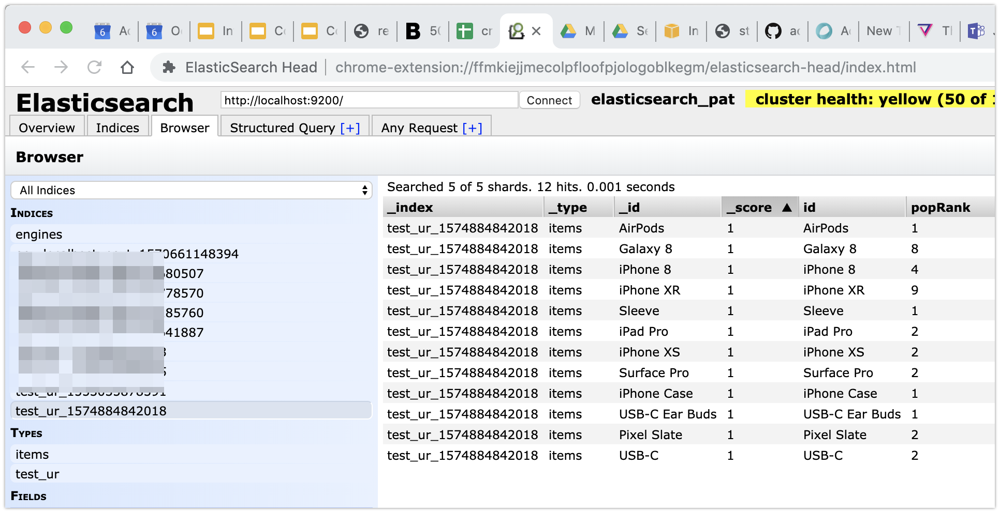
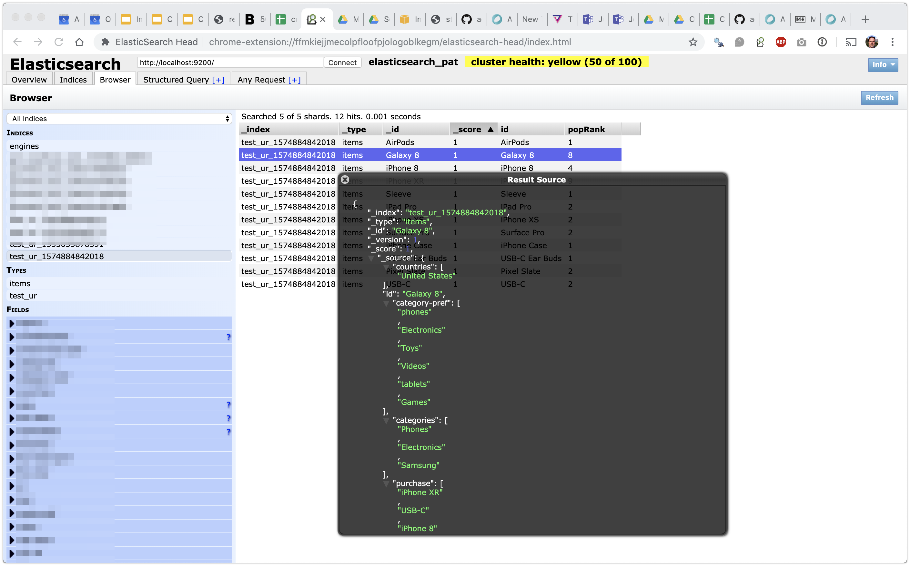

# Debugging Your Model In Elasticsearch

We often get questions about why a query returns certain results. Results are sometimes non-intuitive and may be based on incorrect data or models. In order to dive into results, looking at the UR model in Elasticsearch is very useful. This can often point us in the best direction to solve a problem. Machine Learning has as much potential for Data bugs as Software bugs.

## The Debugging Tool: Elasticsearch Head

Install and enable the Chrome extension called  [Elasticsearch Head](https://chrome.google.com/webstore/detail/elasticsearch-head/ffmkiejjmecolpfloofpjologoblkegm?utm_source=chrome-ntp-icon). Launch it from its app button in Chrome. Set the Elasticsearch server address port 9200, which is the default REST port for Elasticsearch. If you are running ES from the ActionML docker-compose project or have installed natively on your OS, ES should be on `http://localhost:9200` 

The plugin will now provide several tabs that allow you to examine the contents of Elasticsearch. Try the "Browse" tab to see the contents of an index. The UR names indexes after the Engine-ID + timestamp. The timestamp is the linux epoch time on the server when the index was finalized during the last phase of training.

Click on the index name corresponding to your engine-instance. Several items will be shown in a table. Pick one with the highest "popRank" you can see, it is most likely to have Machine Learning model data, as opposed to only properties taken from $set events.

## Example of a Good Model

The UR comes with some example data. scripts to input, and build a model, which is stored in Elasticsearch. Go to the location you have installed the `harness-cli` and run `./examples/ur/simple-integration-test.sh` to populate Elasticsearch with model data. 

When you have set the URL to [`http://localhost:9200`](http://localhost:9200) click on the "Browse" tab and pick an item wih the highest `popRank`. A new in-browser window will pop up to show the contents of the Elasticsearch "document" corresponding to a UR item. 

Notice that only the `_source` section of the document is important, the rest are reserved for use by Elasticsearch.

There are several properties in `_source` that apply to the UR's CCO model. Each will be named after one of the `indicators.name` values in  the engine's JSON config. Roughly speaking these values correspond to similar items or ids that correlate in some way with users converting on the `_id`.

The `popModel` property gives a numeric value that is used to rank all items. It is created by the UR's popularity calculation. The ranking of popular items will cause them to be included in recommendations if there are not other CF based recommendations for the query.

The other named fields are properties attached to the item via the `$set` input. These are used in business rules. Check here to make sure the proper type and value for the properties is being set with your input. The example dataset has various categorical string arrays and date properties. 

## Missing or Malformed Property Values

Check that the properties for items are correct. If not look back to your `$set` input as the likely source of the problem. See [UR Input](docs/h_ur_input) for formatting examples.
