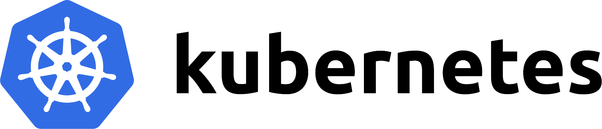

# Harness on Kubernetes

The requirements of high demand applications often dictate a scalable deployment of Harness and its Engines. All Algorithms are designed to offer virtually unlimited scalability. However deployment of these systems comes with some complexity. Rather than maintain exhaustive how-tos and docs for this we have created a modern solution with our Kubernetes based deployment.

<a href="https://kubernetes.io/" target="_blank">Kubernetes</a> is rapidly becoming the standard for demanding systems and even automates a great deal of tedious operational processes. It is supported by all the big public cloud providers and so is our container orchestration platform. 

Kubernetes uses the same Docker images that we maintain in OSS so leverages all work done in the Harness OSS project since Harness makes releases by updating Docker container images.

We maintain a full Kubernetes based deployment stack for the maximum in flexibility and automation and have used it in many production deployments. This includes:

 - Harness with all build-in Engines
 - The Universal Recommender
 - MongoDB
 - Elasticsearch
 - Apache Spark
 - Apache HDFS
 - Prometheus and Grafana
 - Helm charts for all Kubernetes resources
 - Kops specifications for public Cloud resources (like AWS)
 - Kubernetes Cronjobs for automated training.

Unfortunately to use it requires some customization so we do not support it in Open Source. [Contact AcionML](/#contact) for more information.